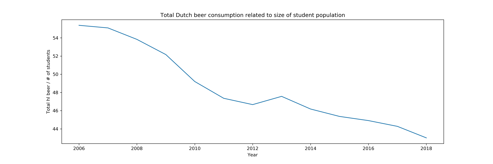

### Seminars Computational Science\
#### Jorrim Prins - 11038934\
\
##### Papers of importance\
* Fantastic yeasts and where to find them: the hidden diversity of dimorphic fungal pathogens\
* An analysis of the forces required to drag sheep over various surfaces\
* The neurocognitive effects of alcohol on adolescents and college students\
\
\
\
The graph shows a decline of total hectoliters of beer consumed by the complete Dutch population per student in almost every year from 2006 to 2018. More information (on total Dutch population) is necessary to state anything specific about the effect, as the decreasing line could also be an effect of a decreasing student/total population ratio.}

